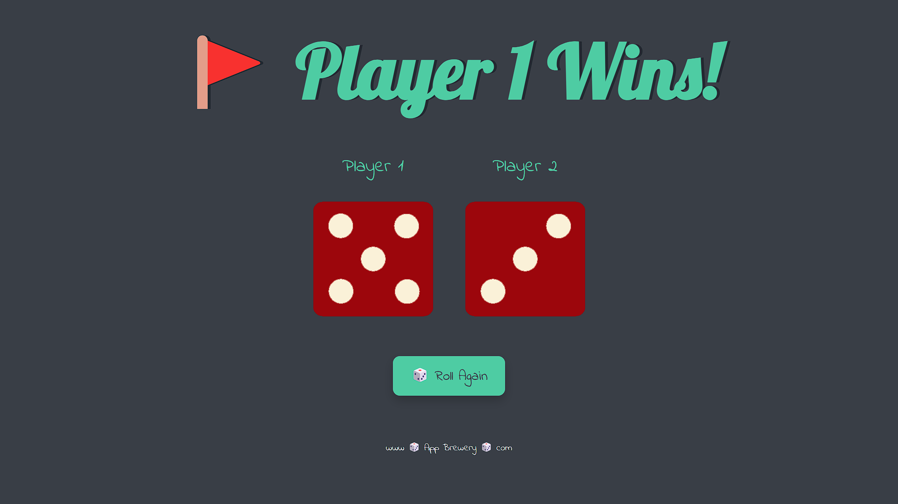

# dice-game
# 🎲 Dice Game

This is a simple and interactive Dice Game built using **HTML**, **CSS**, and **JavaScript**. Two dice are rolled randomly to determine the winner between Player 1 and Player 2.

---

## 🚀 Live Demo

🔗 [Play the Game Here](https://manoj-9899.github.io/dice-game/)  

---

## 📸 Screenshot

  

---

## 🛠️ Features

- 🎯 Random dice roll simulation
- 🧑‍🤝‍🧑 Player 1 vs Player 2 logic
- 🔁 “Roll Again” button to reload the game
- 🎨 Styled with custom CSS and responsive design

---

## 🧰 Tech Stack

- HTML5
- CSS3
- JavaScript (ES6)

---

## 📁 Project Structure

dice-game/
├── images/
│ ├── dice1.png
│ ├── dice2.png
│ └── ...dice6.png
├── index.html
├── styles.css
├── index.js
└── README.md

